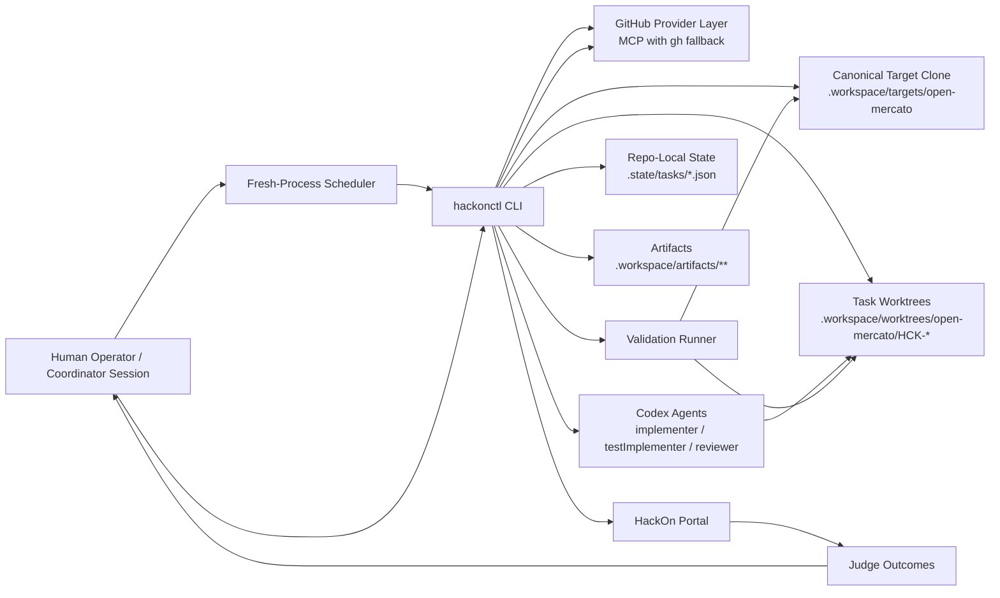
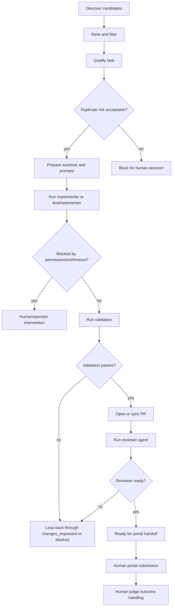
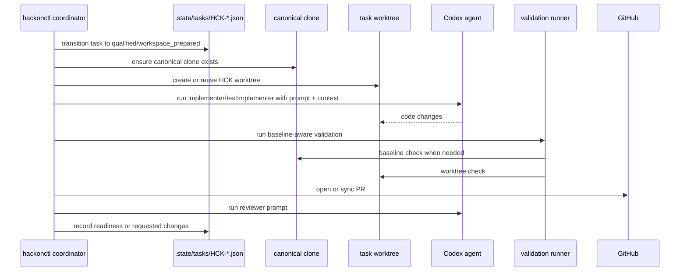
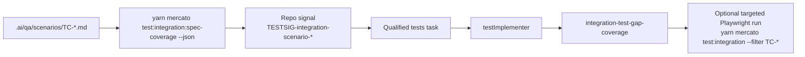

# HackOn Bounty Hunting Setup

Generated at: `2026-04-11T14:26:35Z`

Source of truth for this document:

- `packages/hackonctl/README.md`
- `.ai/specs/2026-04-10-hackon-contribution-coordinator.md`
- `.state/hackonctl-two-session-sop.md`
- `.state/coordinator-status.md`
- `.state/tasks/*.json`

## Executive Summary

Our bounty-hunting setup is a terminal-first control plane built around `@open-mercato/hackonctl`. It automates the safe parts of issue intake, worktree preparation, implementer/reviewer agent runs, validation, and PR packaging while keeping all coordinator state in the repository itself.

The design principle is simple:

- keep runtime state local and inspectable
- keep automation bounded to low-risk lanes
- keep a single writer for task state
- make every autonomous action auditable through artifacts
- stop at explicit human checkpoints for portal submission, judge handling, and ambiguous duplicate-risk decisions

At the moment, the system is operating with a fresh-process scheduler pattern instead of a long-lived in-memory loop:

```bash
while true; do yarn hackonctl drive green --once --target-active 6 --limit 6 --concurrency 6 --discover-limit 24; sleep 300; done
```

That pattern is important because each cycle picks up the latest built `hackonctl` code and re-reads state from disk cleanly.

## What The System Is

`hackonctl` is a coordinator CLI. It is not a web app, not a daemon, and not a database-backed service.

It manages:

- discovery of work from GitHub issues and local repository signals
- qualification into bounded task records
- preparation of canonical clone and per-task worktrees
- agent execution through `codex exec`
- validation and duplicate checkpoints
- PR open/sync/ready workflow
- artifact emission for prompts, logs, blockers, and validation outcomes

It does not fully automate:

- human duplicate-risk overrides
- HackOn portal submission
- judge decision making
- product/tooling governance decisions
- approval-sensitive actions unless the coordinator explicitly allows them

## Architecture

### High-Level Components



### Runtime Layout

```text
hackonctl.config.json              # coordinator config
.state/
  coordinator-status.md            # coordinator heartbeat/status
  discovery/latest.json            # most recent discovery snapshot
  meta.json                        # task sequence state
  tasks/HCK-*.json                 # authoritative task records

.workspace/
  targets/open-mercato/            # canonical managed target clone
  worktrees/open-mercato/HCK-*/    # per-task worktrees
  artifacts/
    discovery/*.json               # discovery snapshots
    HCK-*/
      runs/                        # implementer/reviewer run logs and metadata
      validation/                  # validation artifacts
      blockers/                    # structured blocker artifacts
      branch/                      # branch packaging artifacts
```

### Single-Writer State Model

The coordinator is the only component allowed to mutate `.state/tasks/*.json`.

Why this matters:

- implementer and reviewer agents can edit code, but they cannot directly move workflow state
- the coordinator can restart and recover from disk
- every state transition remains auditable
- race conditions are reduced because task progression is centralized

This boundary is reinforced by the two-session SOP:

- coordinator session owns live runtime operations and `.state/tasks/**`
- tooling session owns `packages/hackonctl/**` and can only run tests/build/typecheck, not the live loop

## Autonomous Workflow

### Green-Lane Scope

Only bounded low-risk lanes are allowed to run autonomously:

- `docs`
- `tests`
- `simple_bugs`

The `experimental` lane is not auto-dispatched.

### End-to-End Autonomous Flow



### Discovery Sources

The system currently analyzes two classes of work:

1. GitHub issues
2. Repository signals mined from the managed target clone

Repository signals currently include:

- missing docs/sidebar wiring
- broken docs links
- stale docs commands
- orphan docs pages
- skipped tests
- `test.todo` / `it.todo`
- low-level modules without nearby tests
- uncovered QA scenarios from `yarn mercato test:integration:spec-coverage --json`

### Discovery Data Flow

```mermaid
sequenceDiagram
    participant Loop as Scheduler / drive green
    participant Disc as discover
    participant GH as GitHub search
    participant Repo as Repo-signal miners
    participant State as .state/discovery + task store

    Loop->>Disc: run discover
    Disc->>GH: query docs/tests/simple_bugs search plans
    Disc->>Repo: mine target clone for exact local signals
    GH-->>Disc: candidate issues
    Repo-->>Disc: candidate repo signals
    Disc->>Disc: score, de-duplicate, lane-match
    Disc->>State: write discovery snapshot
    Loop->>State: qualify selected candidates into HCK tasks
```

### Execution Data Flow



## Dedicated Integration-Test-Gap Pillar

The latest evolution of the setup promotes uncovered integration scenarios into a dedicated pillar inside the `tests` lane.

What changed:

- uncovered `.ai/qa/scenarios/TC-*.md` items are mined from spec coverage
- those tasks are prioritized ahead of generic repo-signal backlog
- they run through a dedicated `testImplementer` profile
- they receive QA-specific prompts and guides
- validation checks whether the specific `TC-*` remains uncovered, not whether the whole repository has zero remaining coverage debt
- optional Playwright validation is filtered to the target scenario ID

Integration-gap flow:



## Human Intervention Boundaries

The system is intentionally not fully autonomous. The table below is the real boundary model.

| Stage | Autonomous? | Human Required? | Why |
| --- | --- | --- | --- |
| GitHub issue search and repo-signal mining | Yes | No | Safe read-only discovery |
| Candidate scoring and green-lane selection | Yes | No | Bounded heuristics |
| Qualification for low-risk work | Yes | Sometimes | Duplicate-risk edge cases can block |
| Worktree creation and prompt generation | Yes | No | Fully coordinator-managed |
| Implementer / testImplementer runs | Yes | Sometimes | Permission, missing-tool, or timeout blockers require intervention |
| Fully autonomous validation profiles | Yes | No | Safe local checks |
| Approval-sensitive validation profiles | No by default | Yes | Coordinator must explicitly allow |
| PR open / sync | Yes | Sometimes | Network/auth/tooling failures can require operator action |
| Reviewer-agent pass | Yes | No | Still coordinator-managed |
| Portal submission | No | Yes | Explicit manual checkpoint in v1 |
| Judge decision | No | Yes | External human decision |
| Judge result recording | Partly | Yes | Coordinator records outcome after human signal |
| Tooling/runtime upgrades | No | Yes | Coordinator must restart the live loop after tooling changes |

### Concrete Human Checkpoints In The Current Setup

Human intervention is required at these points today:

1. When duplicate risk is `likely_duplicate` or `split_risk` and an override/differentiation decision is needed.
2. When approval-sensitive validation should be enabled.
3. When implementer/reviewer runs are blocked by permission, missing tools, network, or timeout conditions.
4. When a PR is ready for HackOn portal submission.
5. When the judge approves, rejects, or requests changes.
6. When tooling changes `hackonctl` itself and the live loop must be restarted.

## Current Operating Snapshot

### Live Scheduler

Latest coordinator heartbeat (`.state/coordinator-status.md`) reports:

- scheduler status: `running`
- mode: fresh-process `--once` loop
- active target: `6`
- dispatch limit: `6`
- concurrency: `6`
- discover limit: `24`

### Metrics Snapshot

These counts are derived from `.state/tasks/*.json` at document generation time.

The task files are the authoritative state source. The human-readable coordinator heartbeat in `.state/coordinator-status.md` can lag by one loop cycle.

| Metric | Value |
| --- | ---: |
| Total tracked tasks | 40 |
| GitHub-issue-backed task records | 6 |
| Unique GitHub issues analyzed into task state | 5 |
| Repo-signal-backed task records | 34 |
| Unique repo signals analyzed into task state | 33 |
| PRs produced | 21 |

Note: GitHub issue `#109` appears twice in task history because one attempt was closed as a duplicate and a later attempt is the active working branch.

### Current Task-State Breakdown

| Task State | Count |
| --- | ---: |
| `qualified` | 5 |
| `implementing` | 4 |
| `changes_requested` | 2 |
| `judge_pending` | 3 |
| `judge_approved` | 9 |
| `judge_rejected` | 1 |
| `human_required` | 3 |
| `abandoned` | 12 |
| `duplicate_closed` | 1 |

### Current PR Status Breakdown

PR statuses below use the coordinator task state, not GitHub's generic open/closed labels.

| PR-Backed Task State | Count |
| --- | ---: |
| `judge_approved` | 9 |
| `judge_pending` | 3 |
| `changes_requested` | 2 |
| `implementing` | 1 |
| `human_required` | 3 |
| `judge_rejected` | 1 |
| `abandoned` | 2 |

### Interpretation Of The Metrics

- The system has analyzed far more local repo-signal work than GitHub issue work so far.
- PR output is already material: `21` PRs have been created from the coordinator pipeline.
- The biggest successful bucket is `judge_approved` with `9` PR-backed tasks.
- The main non-terminal backlog is split across `qualified`, `implementing`, `changes_requested`, and `judge_pending`.
- There is a visible human-mediated tail: `human_required`, `judge_rejected`, and `abandoned` states show where autonomy intentionally stops or where work is no longer worth continuing.

## Current PR Inventory

The table below is the current PR-backed task inventory from `.state/tasks/*.json`.

| PR | Task | Source | Current Task State | Judge | Portal | Title |
| --- | --- | --- | --- | --- | --- | --- |
| #1189 | HCK-0003 | repo_signal:DOCSIG-readme-getting-started-grammar | judge_approved | approved | submitted | README getting-started grammar: 'a quickest way' |
| #1190 | HCK-0006 | github_issue:173 | abandoned | pending | submitted | feat: add docs to user guide section about attachments |
| #1191 | HCK-0004 | github_issue:330 | human_required | rejected | submitted | bug: add screenshot to workflows documentation |
| #1192 | HCK-0005 | github_issue:966 | human_required | rejected | submitted | bug: enterprise security module isn't installed but bootstrap.ts |
| #1196 | HCK-0007 | repo_signal:DOCSIG-sidebar-user-guide-checkout | judge_approved | approved | submitted | docs: add missing sidebar entry for user-guide/checkout |
| #1197 | HCK-0009 | repo_signal:TESTSIG-skipped-packages-cli-src-lib-generators-tests-generators-test-ts-should-export-generatea | judge_approved | approved | submitted | tests: re-enable skipped test "should export generateApiClient" |
| #1198 | HCK-0013 | repo_signal:TESTSIG-lowlevel-untested-packages-shared-src-lib-auth-jwt-ts | judge_approved | approved | submitted | tests: add low-level coverage for jwt.ts |
| #1199 | HCK-0011 | repo_signal:TESTSIG-lowlevel-untested-packages-shared-src-lib-bootstrap-appresolver-ts | judge_approved | approved | submitted | tests: add low-level coverage for appResolver.ts |
| #1200 | HCK-0012 | repo_signal:TESTSIG-lowlevel-untested-packages-shared-src-lib-boolean-ts | judge_approved | approved | submitted | tests: add low-level coverage for boolean.ts |
| #1201 | HCK-0010 | repo_signal:TESTSIG-lowlevel-untested-packages-shared-src-lib-bootstrap-dynamicloader-ts | human_required | rejected | submitted | tests: add low-level coverage for dynamicLoader.ts |
| #1205 | HCK-0015 | repo_signal:TESTSIG-lowlevel-untested-packages-shared-src-lib-api-crud-ts | judge_approved | approved | submitted | tests: add low-level coverage for crud.ts |
| #1206 | HCK-0014 | repo_signal:TESTSIG-lowlevel-untested-packages-shared-src-lib-auth-passwordpolicy-ts | judge_pending | pending | submitted | tests: add low-level coverage for passwordPolicy.ts |
| #1207 | HCK-0016 | repo_signal:TESTSIG-lowlevel-untested-packages-shared-src-lib-auth-featurematch-ts | judge_approved | approved | submitted | tests: add low-level coverage for featureMatch.ts |
| #1208 | HCK-0017 | repo_signal:TESTSIG-lowlevel-untested-packages-shared-src-lib-api-context-ts | judge_rejected | rejected | submitted | tests: add low-level coverage for context.ts |
| #1209 | HCK-0018 | repo_signal:TESTSIG-lowlevel-untested-packages-create-app-template-src-lib-metadata-ts | judge_approved | approved | submitted | tests: add low-level coverage for metadata.ts |
| #1210 | HCK-0019 | repo_signal:TESTSIG-lowlevel-untested-packages-cli-src-lib-umes-collector-ts | abandoned | pending | submitted | tests: add low-level coverage for collector.ts |
| #1227 | HCK-0035 | github_issue:696 | changes_requested | not_started | not_started | bug: Custom fields of `kind: 'relation'` render as raw UUIDs instead of entity titles/links in DataGrid |
| #1228 | HCK-0036 | github_issue:109 | implementing | not_started | not_started | bug: deleting a deal from Customer or Company page should deassign, not delete the record |
| #1230 | HCK-0022 | repo_signal:TESTSIG-lowlevel-untested-packages-cli-src-lib-umes-check-ts | changes_requested | not_started | not_started | tests: add low-level coverage for check.ts |
| #1231 | HCK-0021 | repo_signal:TESTSIG-lowlevel-untested-packages-cli-src-lib-umes-list-ts | judge_pending | pending | submitted | tests: add low-level coverage for list.ts |
| #1234 | HCK-0020 | repo_signal:TESTSIG-lowlevel-untested-packages-cli-src-lib-umes-inspect-ts | judge_pending | pending | submitted | tests: add low-level coverage for inspect.ts |

## Why This Setup Works

The setup works because it keeps four things true at the same time:

1. It is easy to inspect.
Every important decision is represented by local JSON state or a saved artifact.

2. It is easy to recover.
Because the coordinator is file-based and fresh-process-friendly, restarts are cheap.

3. It is bounded.
Only low-risk lanes are auto-dispatched, and architecture-heavy or ambiguous work is filtered out.

4. It respects human governance.
The system automates preparation and iteration, but it stops before portal submission, judge outcomes, and non-obvious duplicate-risk decisions.

## Current Limitations

This is still a v1 control plane. Current limitations include:

- no dedicated command family yet for integration-gap-only discover/dispatch
- no dashboard; state inspection is still terminal and file based
- duplicate detection is heuristic, not semantic
- portal and judge flow are still manual checkpoints
- validation coverage is strong for bounded tasks, but not exhaustive for the whole monorepo

## Recommended Talking Points For Teammates

- This is not "AI writes code unsupervised"; it is a bounded coordinator with explicit human checkpoints.
- The real product is the workflow: discovery, qualification, state control, worktree isolation, artifacts, and disciplined handoff.
- The strongest proof of value is not the architecture slide by itself; it is the `21` PRs already produced with a clear state trail.
- The most important design choice is the single-writer coordinator model. That keeps agent output useful without letting agents corrupt workflow state.
